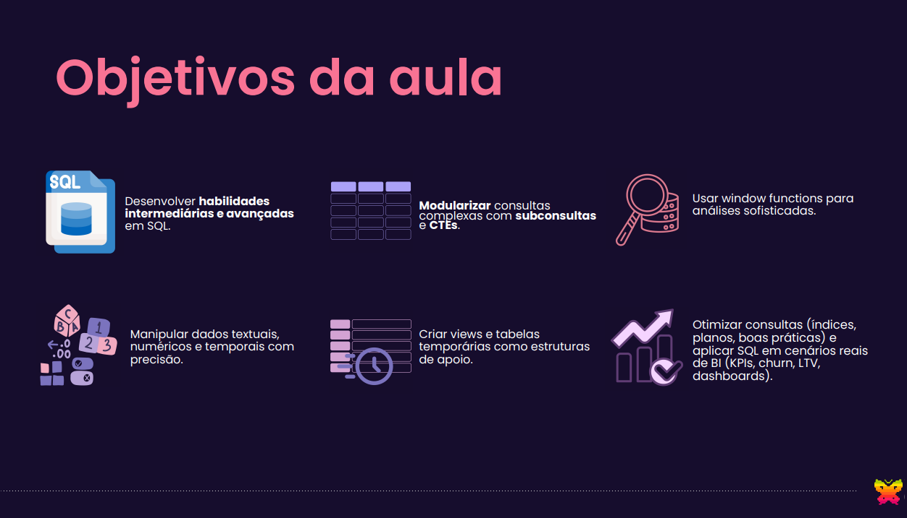

# Banco de Dados SQL 2

Nesse repositório você encontrará os materiais necessários para utilizar durante o módulo de SQL Avançado. Deixarei também alguns conteúdos de recomendação para vocês. Espero que gostem da aula! Estou disponível também para tirar as dúvidas de vocês, por favor, entrem em contato comigo. =)

